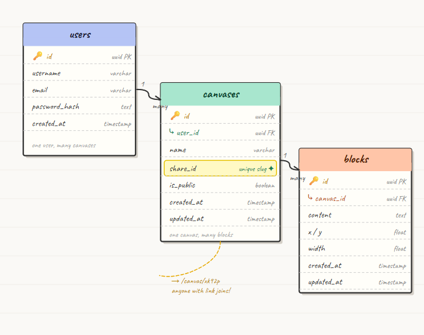

# free-form

An infinite canvas where you can write and run JavaScript freely — inspired by Excalidraw. Drop code blocks anywhere on the canvas, execute them in real time, and share your canvas with others.

## Features

- **Infinite canvas** — drag, drop, and arrange code blocks anywhere
- **Live code execution** — run JavaScript and see output instantly
- **Real-time updates** — changes sync across clients via Socket.IO
- **Job queue** — code runs are queued through BullMQ so the server stays stable under load
- **Canvas sharing** — share a read-only link to your canvas with others
- **Authentication** — sign up, log in, and manage your own canvases
- **Dark / light mode**

## Tech Stack

| Layer      | Technology                              |
|------------|-----------------------------------------|
| Frontend   | React 19, TypeScript, Vite, Tailwind CSS, CodeMirror |
| Backend    | Node.js, Express, TypeScript, Socket.IO |
| Database   | PostgreSQL                              |
| Queue/Cache| Redis, BullMQ                           |
| Container  | Docker, Docker Compose, nginx           |

## Database Schema



## Prerequisites

**To run with Docker (recommended):**
- [Docker](https://docs.docker.com/get-docker/)
- [Docker Compose](https://docs.docker.com/compose/install/) (included with Docker Desktop)

**To run locally without Docker:**
- Node.js 20+
- PostgreSQL
- Redis

## Running the App

### With Docker (recommended)

1. Clone the repo:
   ```bash
   git clone https://github.com/rcjasub/free-form-Code.git
   cd free-form-Code
   ```

2. Create the backend env file:
   ```bash
   cp backend/.env.example backend/.env
   ```
   Fill in the values (see [Environment Variables](#environment-variables)).

3. Start everything:
   ```bash
   docker compose up --build
   ```

4. Open [http://localhost](http://localhost) in your browser.

To stop:
```bash
docker compose down
```

---

### Without Docker (local dev)

1. Install dependencies:
   ```bash
   cd backend && npm install
   cd ../my-app && npm install
   ```

2. Make sure PostgreSQL and Redis are running locally, then create `backend/.env` (see below).

3. Start both servers from the `my-app` folder:
   ```bash
   npm run dev
   ```

   This starts the backend on `http://localhost:4000` and the frontend on `http://localhost:5173`.

## Environment Variables

Create `backend/.env` with the following:

```env
PORT=4000

# Database
DB_HOST=localhost
DB_PORT=5432
DB_NAME=freeformcode
DB_USER=postgres
DB_PASSWORD=yourpassword

# Redis
REDIS_URL=redis://localhost:6379

# Auth
JWT_SECRET=your_jwt_secret

# Frontend origin (for CORS)
CLIENT_URL=http://localhost:5173
```

> When running with Docker, `DB_HOST` and `REDIS_URL` are overridden automatically by `docker-compose.yml` to use the container service names.

## Project Structure

```
free-form-Code/
├── backend/
│   ├── controllers/        # Route handlers (auth, canvas, blocks, run)
│   ├── routes/             # Express route definitions
│   ├── models/             # Database models
│   ├── middleware/         # Auth middleware
│   ├── queue.ts            # BullMQ job queue setup
│   ├── worker.ts           # Queue worker (processes code execution jobs)
│   ├── redis.ts            # Redis client
│   ├── socket.ts           # Socket.IO setup
│   ├── server.ts           # Entry point
│   └── Dockerfile
├── my-app/
│   ├── src/
│   │   ├── pages/          # Dashboard, Canvas, Home, SharedCanvas
│   │   ├── components/     # UI components (CodeBlock, FloatingNode, etc.)
│   │   ├── API/            # Axios API calls
│   │   └── hooks/          # Custom React hooks
│   ├── nginx.conf          # Serves SPA + proxies /api and /socket.io to backend
│   └── Dockerfile
├── docs/
│   ├── docker.md           # Docker concepts and setup explained
│   └── redis-and-queues.md # Queue and caching architecture explained
└── docker-compose.yml      # Orchestrates all four services
```

## How Code Execution Works

When a user clicks Run, the request is not executed immediately. Instead:

1. Express adds the job to a BullMQ queue backed by Redis
2. A separate worker process picks up the job and runs the code
3. The result is sent back to the specific user via Socket.IO using their `socketId`

This keeps the server stable under load — see [docs/redis-and-queues.md](docs/redis-and-queues.md) for a full breakdown.
